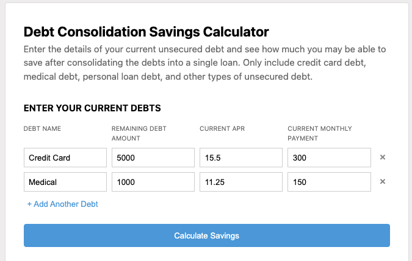
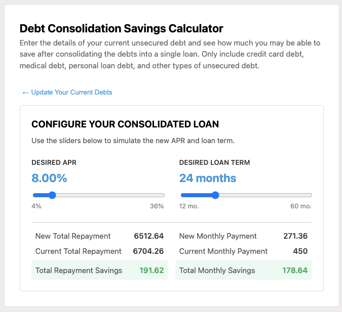

# Supermoney Debt Condolidation Calculator Project:

**Demo:** https://www.loom.com/share/ec7e55806e7c4b43b189257935ae048e?sid=89fde88b-3d46-407d-851f-7cdbd0089457

# Table of Contents

1. [How to Run](#run)
2. [Assignment](#assignment)
3. [Submission](#submission)

# How to Run <a name="run"></a>:

Run these commands in the root directory:

```
npm install
npm run dev
```

# Assignment <a name="assignment"></a>:

Build a browser based Debt Consolidation Savings Calculator

### Background:

Consumers may have many high interest debts, like auto loans, credit cards, or other installment loans. They can save money by combining all of their high interest debts into a single loan with a lower interest rate.

We want to help consumers determine exactly how much money they can save by consolidating their loans.

### Description:

Use the prototype to create a browser based debt consolidation savings calculator. (link to prototype not included in this repo)

Users can enter the details of their multiple high interest debts, and the calculator will show them how much they can save with a single consolidated loan. The amount of the new loan will be the sum of the outstanding balances of the existing loans. The user can change the potential term and APR of their consolidated loan to see how those affect the monthly payments and overall repayment.

- The solution would preferably be written in React, but any modern Javascript framework will be acceptable (not JQuery).
- The submission should run in any modern browser (IE compatibility not required)
- A financial calculations library has been included to simplify the loan calculations. Check the link for documentation. Some people seem to have issues figuring out how to use the recommended library, so feel free to use other libraries.

# Submission <a name="submission"></a>

### Screenshots




### Breakdown of Time Spent

- 1.5 hours - input page
- 2.5 hours - writing util functions to do debt consolidation calculations and consolidated loans page
- 1 hour code cleanup + readme writeup

### Potential Improvements Given More Time

- Unit tests for the util functions
- Better form validation when entering the debts for better ux and less bugs
- Sticking closer to the given design
- Creating two Debt types for the form inputs and for the utils since the form requires strings and the utils code would be cleaner if the types were numbers. This eliminates the requirement of parseFloat.
